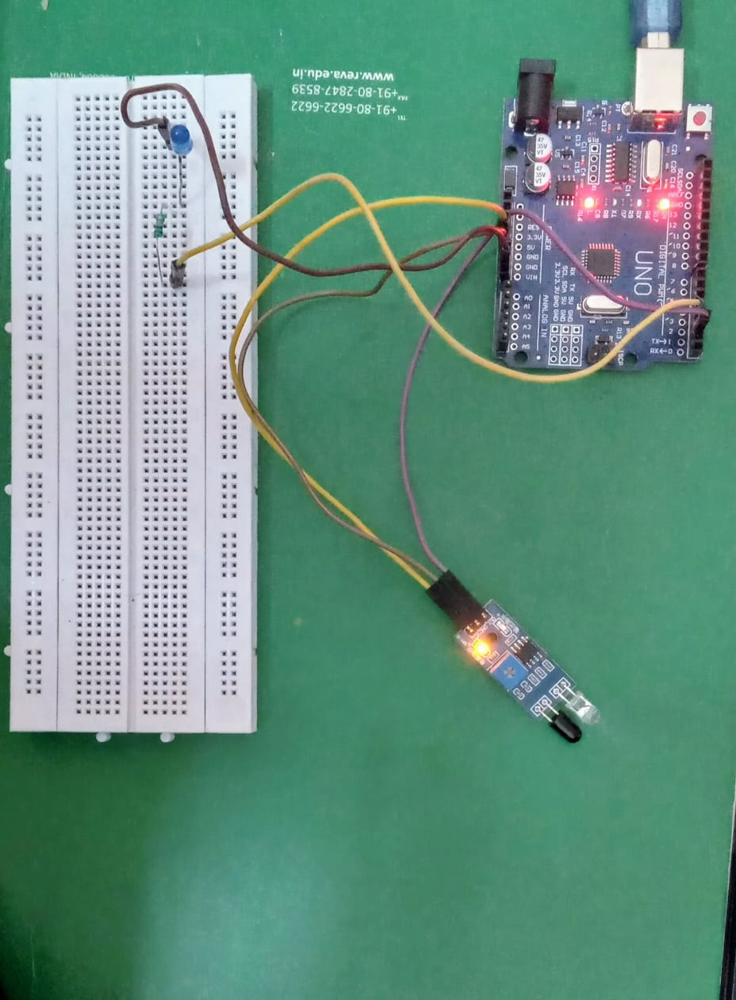

# IR-Sensor-LED-Project

# Arduino IR Sensor + LED Project

## 📌 Overview
This is a beginner-friendly Arduino project that uses an **IR sensor** to detect obstacles.  
- When an **object is detected**, the LED turns **ON** and "🚨 Object Detected!" is printed on the Serial Monitor.  
- When **no object is detected**, the LED stays **OFF** and "Clear" is printed on the Serial Monitor.  

---

## 🛠 Components
- Arduino Uno (or any compatible board)
- IR sensor module (or push button for simulation)
- LED
- Resistor (220Ω)
- Jumper wires
- Breadboard

---

## ⚡ Circuit Setup
- IR sensor OUT → Arduino pin 2  
- LED → Arduino pin 3 (through 220Ω resistor)  
- IR sensor VCC → 5V  
- IR sensor GND → GND  


## Demo Video
[Watch on Google Drive](https://drive.google.com/your-video-link)


---

## 💻 Arduino Code
```cpp
int sensorPin = 2;   // IR sensor OUT pin
int ledPin = 3;      
int sensorValue = 0;

void setup() {
  pinMode(sensorPin, INPUT);
  pinMode(ledPin, OUTPUT);
  Serial.begin(9600);
}

void loop() {
  sensorValue = digitalRead(sensorPin);

  if (sensorValue == LOW) { // Object detected
    Serial.println("🚨 Object Detected!");
    digitalWrite(ledPin, HIGH);  // LED ON
  } else {
    Serial.println("Clear");
    digitalWrite(ledPin, LOW);   // LED OFF
  }

  delay(200);
}
